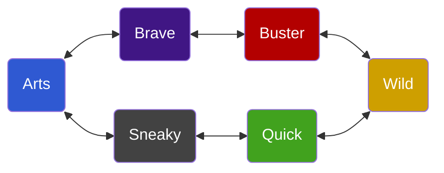

# Quick Reference

??? question "Click here for the Action and Rolling FAQ"

	**Q: Can I Create An Advantage with a Combat Style?**
	Yes, when deemed appropriate.
	
	**Q: How do I do a multi-target roll?**
	1. Do one regular Action roll.
	2. Distribute resulting Shifts among targets. 
	3. Each target can Defend against their incoming Shifts.
	
	**Q: How do I roll against a full zone?**
	1. Do one regular Action roll. 
	2. Each person in the Zone Defends against that number. 

## Armor & Weapon
*(See: [Adopted Rules](adopted-rules.md))*

- Apply only when the Attack is successful. 
- Does not elevate a Success to Succeed With Style

**Weapon**

* Add Weapon Level to the total damage dealt. 
* On a Tie, deal Weapon Level as damage instead of gaining a Boost

**Defend**

* Subtract Armor Level from the total damage received.
* If Armor reduces damage to 0, Attacker gains a Boost. 

## Fate Points

Fate Points can be spent to:

1. Invoke an Aspect
2. Compel an Aspect
3. Declare a Story Detail
4. Power a Stunt

Fate Points can be earned by:

1. Accepting a Compel
2. Hostile Invokes on your Character/Consequence Aspects, paid with Fate Points
3. Concede from a conflict

??? question "Click here for the Fate Point FAQ"

    **Q: If my refresh is full, can I still earn FP?**
    
	Yes!
	
	**Q: Session ended in the middle of combat. Do I get my FP back?**
	
	No! 
	
	**Q: Does it cost anything to refuse a Compel?**
	
	No; you are already losing out on the offered Fate Point. 
	
	**Q: How many FP does the GM get?**
	
	One for each PC in the scene, shared by all NPCs.

??? question "Click here for the Aspects & Command Seals FAQ"

	**Q: What's a Boost?**
	
	A single-use Aspect, always free to invoke.
	
	**Q: How many Free Invokes can I use at once?**
	
	As many as you want. 
	
	**Q: Can I use Free Invokes from different Aspects at the same time?**
	
	Yes
	
	**Q: Can I use a Fate Point with Free Invokes?**
	
	Yes, but only one.
	
	**Q: What happens when I use a Command Seal?**
	
	* Create an Aspect named after the Command
	* Aspect gets 2 Free Invokes
	* Aspect can be invoked for +3 instead of +2

## Combat

### ROAR!

1. Player Roll against +2 to Create An Advantage using a Combat Style.
2. GM gets a chance to Create An Advantage
3. Repeat until all Players participating in the Roar have Roared

**Keeping Your Roar Aspect:**

*  Player's Attacks only use their Roar Style or an adjacent Style. 
*  When Player uses another Style to Attack, the Roar Aspect is removed.

??? question "Click here for the Roar Phase FAQ"

	**Q: What is the difficulty for a Roar?**
	
	+2 (Good)
	
	**Q: What is the penalty for failing on the Roar?**
	
	The same as any Create An Advantage -- do not create, or an adversary gets the Free Invoke.
	
	**Q: Do I lose my Roar if I Defend with another Style?**
	
	No. Currently, we are ruling it so that only Attacks count.

### Movement

* **No opposition:** You may take an Action *and* move to another Zone.
* **Something/Someone in the way:** Must use your Turn to Overcome if you want to move.
* **Move to any Zone:** Overcome a challenging opposition set by the DM.

### Health & Consequences

1. When you take a Consequence, the enemy gets 1 Free Invoke.
2. When you've had a chance to rest or heal, rename your Consequence to put it in Recovery. 
3. Remove Consequence after time has passed in Recovery.

| Severity | Recovery Time |
|--------|------|
| Mild | One scene |
| Moderate | One session |
| Severe | Three sessions |

**Entering New Combat With A Consequence In Recovery**

1. Enemies get 1 Free Invoke on each Consequence you have. 
2. The corresponding stress bar is available to use. 
3. If that bar is broken, the Consequence is re-opened and no longer in Recovery.

### Battle Outcomes

| Type | Trigger | Outcome |
|---|-----------|-----|
| Concede | Any point except when resolving a completed dice roll. | You control your fate.  Gain FP. |
| Taken Out | When you can no longer take Stress. | Attacker decides your fate. |
| Extreme Consequence | When you would be Taken Out. | Replace a Character Aspect. | 

### Obstacles
| Type | Components |
| ----- | -------------- |
| Hazards | Aspect, Unique Skill, Weapon, a Turn |
| Blocks | Aspect, Unique Skill, optional Weapon | 